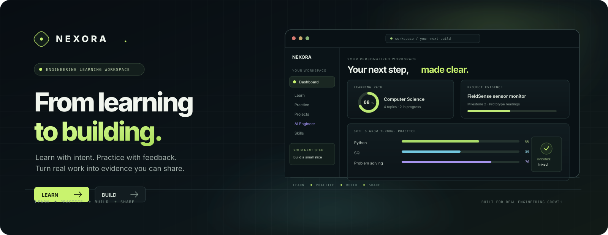

<p align="center">
  
</p>

<p align="center">
  <strong>Learn with intent. Practice with feedback. Turn real work into evidence you can share.</strong>
</p>

<p align="center">
  <a href="https://github.com/sauravprivatelimited369-byte/SK-Nexora-nexora/actions/workflows/ci.yml"></a>
  
  
  
  
</p>

<p align="center">
  <a href="#what-you-can-do">Explore the platform</a> ·
  <a href="#quick-start">Run locally</a> ·
  <a href="CONTRIBUTING.md">Contribute</a> ·
  <a href=".github/CODE_OF_CONDUCT.md">Code of conduct</a> ·
  <a href="SECURITY.md">Security</a>
</p>

> **Preview note:** The banner is an illustrative interface concept, not a screenshot or live learner data. The complete app runs as a Next.js server application; [`docs/`](docs/) contains a static overview suitable for GitHub Pages, not the interactive app.

---

## Why NEXORA?

Engineering learning is more useful when the steps connect. NEXORA brings study, deliberate practice, hands-on project work, and career materials into one learner-controlled workspace—without presenting self-reported work as verified credentials.

### What you can do

| Area | Included |
| --- | --- |
| **Learn** | Curated engineering topics, objectives, resources, a personalized path, and saved progress. |
| **Practice** | Server-checked multiple-choice questions, explanations, and recency-weighted mastery estimates. |
| **Build** | Structured project blueprints, milestones, task tracking, private text artifacts, and optional AI analysis. |
| **AI Engineer** | An optional OpenAI-compatible assistant with project context scoped to the signed-in learner. |
| **Skills** | Practice- and project-linked evidence; self-reported skills remain identified as self-reported. |
| **Resume** | A private, editable draft from learner-provided details and project evidence; browser print-to-PDF. |
| **Portfolio** | An unpublished-by-default profile with explicit controls for selected projects, email, and resume visibility. |
| **Account** | Profile and notification preferences, password management, billing summary, and password-confirmed deletion. |

### Trust by design

- **No invented credentials:** the resume builder does not fabricate internships, education, awards, or certifications.
- **Private by default:** portfolios and projects require explicit sharing choices.
- **Evidence is not verification:** NEXORA does not certify skills, verify user-entered credentials, or run submitted code.
- **AI is optional and labeled:** without a configured provider, project planning uses a disclosed structured starter blueprint.
- **Safety matters:** generated engineering plans are starting points; review assumptions and qualified safety requirements before acting.

## Quick start

**Requirements:** Node.js 20.9+ and npm. Node 22 LTS is recommended.

```bash
git clone --branch arena/e9a64c56-sk-nexora-nexora \
  https://github.com/sauravprivatelimited369-byte/SK-Nexora-nexora.git
cd SK-Nexora-nexora
npm ci
cp .env.example .env.local
npm run dev
```

Open [http://localhost:3000](http://localhost:3000) and create a local account. If `DATABASE_URL` is unset, development uses persistent embedded PostgreSQL (PGlite) in `.nexora-data/`. On first use, the app applies the initial migration and inserts its starter content. You can run that explicitly with `npm run db:seed`.

Without SMTP, local registration marks the email verified for development; production registration is intentionally disabled until email delivery is configured. The learning, practice, and structured project-planning flows work without an AI key or payment credentials.

## Configuration

Copy `.env.example` to `.env.local`, then configure only the services you need. **Never commit `.env.local` or paste secrets into issues or pull requests.**

| Variable(s) | Purpose |
| --- | --- |
| `DATABASE_URL` | Managed PostgreSQL connection string; required in production. Leave blank only for local PGlite development. |
| `DATABASE_SSL` | TLS certificate validation is enabled by default. Use `disable` only for a trusted local PostgreSQL server. |
| `APP_URL` | Canonical HTTPS origin for email links, payment callbacks, and the sitemap. |
| `AI_API_KEY`, `AI_BASE_URL`, `AI_MODEL` | Optional server-side OpenAI-compatible chat-completions provider. Never expose the key in browser code. |
| `SMTP_HOST`, `SMTP_PORT`, `SMTP_USER`, `SMTP_PASSWORD`, `SMTP_FROM` | Transactional email for account verification and password reset. Required for production sign-up. |
| `RAZORPAY_KEY_ID`, `RAZORPAY_KEY_SECRET`, `RAZORPAY_WEBHOOK_SECRET`, `RAZORPAY_PRO_PLAN_ID`, `RAZORPAY_CAREER_PLAN_ID` | Optional Razorpay subscription checkout. Configure matching monthly plans and the `/api/billing/webhook` endpoint before enabling live billing. |
| `DATABASE_POOL_MAX` | Optional PostgreSQL connection pool size (default: `5`). |

The embedded database is **for local development only**. Production requires managed PostgreSQL, a verified TLS connection, and a backup/restore plan. See [`.env.example`](.env.example) and the deployment notes below.

## Commands

```bash
npm run dev       # Next.js development server on 0.0.0.0:3000
npm run lint      # TypeScript type-check
npm test          # unit tests
npm run build     # optimized production build
npm start         # serve the production build
npm run db:seed   # apply schema and idempotent starter data
```

## Publish the static GitHub Pages overview

The static overview lives in [`docs/`](docs/). To publish it, a repository administrator can go to **Settings → Pages → Build and deployment**, choose **Deploy from a branch**, select the project branch and the `/docs` folder, then save. GitHub Pages will serve it at `https://sauravprivatelimited369-byte.github.io/SK-Nexora-nexora/`. When the project is merged, switch the Pages source to `main` / `/docs`. This publishes only the static overview—not the interactive Next.js app.

## Deploy the interactive app

1. Provision managed PostgreSQL, set `DATABASE_URL`, and validate the database TLS certificate.
2. Set `APP_URL` to the canonical HTTPS origin; configure SMTP before enabling production registration.
3. Add AI and Razorpay secrets only if those integrations are enabled. Keep provider credentials server-side.
4. Run `npm ci`, `npm run lint`, `npm test`, and `npm run build` in CI before deployment.
5. Deploy the interactive app to a Node.js host that supports Next.js server-rendered routes and persistent PostgreSQL connectivity. Use an appropriate connection pooler on serverless infrastructure.
6. Test sign-up and verification, password recovery, account deletion, subscription webhooks, and public-profile privacy using production-like settings.

> **GitHub Pages is not the application host.** This repository's [`docs/` overview](docs/index.html) is static. The workspace depends on server-rendered routes, secure sessions, and a live database, so deploy it to a Next.js-capable host instead.

## Architecture

- **UI:** Next.js App Router, React, TypeScript, responsive app shell, and a custom system-font visual design.
- **Data:** PostgreSQL schema and indexes in [`db/migrations/0001_init.sql`](db/migrations/0001_init.sql); local development can use PGlite.
- **Auth:** random opaque session tokens are stored hashed; passwords use Node.js `scrypt`; cookies are HTTP-only and production-secure.
- **APIs:** parameterized SQL, Zod request validation, per-user ownership checks, same-origin mutation checks, rate limits, and audit/product event tables.
- **Integrations:** optional SMTP, an OpenAI-compatible AI endpoint, and Razorpay subscriptions. Provider-dependent features remain explicitly unavailable until configured.
- **Public portfolio:** rendered only after explicit portfolio publication; user-level and portfolio-level visibility are both checked.

## Repository pages

- [Static GitHub Pages overview](docs/index.html)
- [Contribution guide](CONTRIBUTING.md)
- [Security policy](SECURITY.md)
- [Bug reports and feature requests](https://github.com/sauravprivatelimited369-byte/SK-Nexora-nexora/issues)

## License

No license has been selected for this repository yet. Until the project owner adds one, the source remains under the default copyright terms; public visibility alone does not grant permission to reuse or redistribute it.
